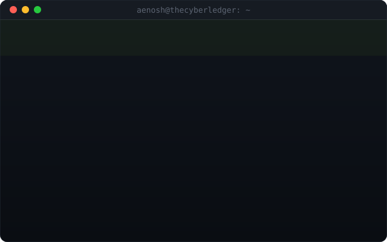

<picture>
  <source media="(prefers-color-scheme: dark)" srcset="assets/terminal_dark.svg" />
  <source media="(prefers-color-scheme: light)" srcset="assets/terminal_light.svg" />
  
</picture>

Live stats — account age, repos, stars, commits and lines of code — plus the <a href="#-latest-public-work">Latest Public Work</a>, <a href="#-most-starred">Most Starred</a> and <a href="#-recently-exploring">Recently Exploring</a> sections below all refresh every 6 hours via <a href="scripts/generate_stats.py">scripts/generate_stats.py</a>, a GitHub Actions cron job.

  
  
  
  
  
  

  

---

# 🧠 About

I'm a cybersecurity professional and founder of **The Cyber Ledger** — a security platform delivering curated cyber news, offensive security series, and hands-on intern training, followed by **1.5K+ security professionals and HR leaders globally**.

I specialize in **Offensive Security, Red Teaming, and Threat Intelligence**, and I build the platforms this work runs on: **TCL Academy** (the LMS — courses, CTF rooms, cohorts, credentials), **TCL Advisory** (a live vulnerability tracker), and **TCL Journal** (the publishing platform), end to end — Node/Express/Prisma and Next.js on the backend and frontend, Postgres via Supabase underneath.

I actively contribute to the offensive security ecosystem as a:
- Google CTF 2025 Player
- EC-Council Hackviser Finalist
- TryHackMe Top 1% User
- Published Security Researcher on Medium

---

# 🌐 Platform Presence

| Platform | Profile |
|---|---|
| The Cyber Ledger | [Visit Platform](https://thecyberledger.in/) |
| TCL Academy | [Start Learning](https://academy.thecyberledger.in/) |
| TryHackMe | [View Profile](https://tryhackme.com/p/ShadowPacket) |
| Medium | [Read Articles](https://aenoshrajora.medium.com/) |
| LinkedIn | [Connect](https://www.linkedin.com/in/aenosh-rajora/) |

---

# ⚔️ Tech Arsenal

## Languages / Development

  

## Offensive Security / Infra

  

**Primary Tooling:**
Burp Suite • BloodHound • Impacket • Metasploit • Nmap • Sliver • Nessus • Wireshark • Responder

---

# 🛠️ Latest Public Work

My 4 most recently pushed-to public repos — updates whenever I push.

<!-- LATEST-PROJECTS:START -->
<!-- LATEST-PROJECTS:END -->

---

# ⭐ Most Starred

My own repos, ranked by star count.

<!-- TOP-REPOS:START -->
<!-- TOP-REPOS:END -->

---

# 🔭 Recently Exploring

Repos I've starred most recently — a rough feed of what's caught my attention.

<!-- STARRED-REPOS:START -->
<!-- STARRED-REPOS:END -->

---

# ✍️ Writing / Research

Published author covering:

- Breach Analysis
- APT Campaigns
- Vulnerability Research
- Threat Intelligence Reports
- Executive Security Briefings

📖 **Read my work on [Medium](https://aenoshrajora.medium.com/) / [The Cyber Ledger](https://thecyberledger.in/)**

<!-- BLOG-POST-LIST:START -->
<!-- BLOG-POST-LIST:END -->

---

# 📊 GitHub Stats

  
  

  

---

# 🤝 Collaboration

Always open to:

- Security Research Collaborations
- Offensive Security Engineering Projects
- Speaking / Mentorship / Training Opportunities
- Building with Other Security Nerds

guest@aenosh ~ % exit

